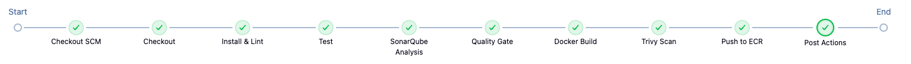
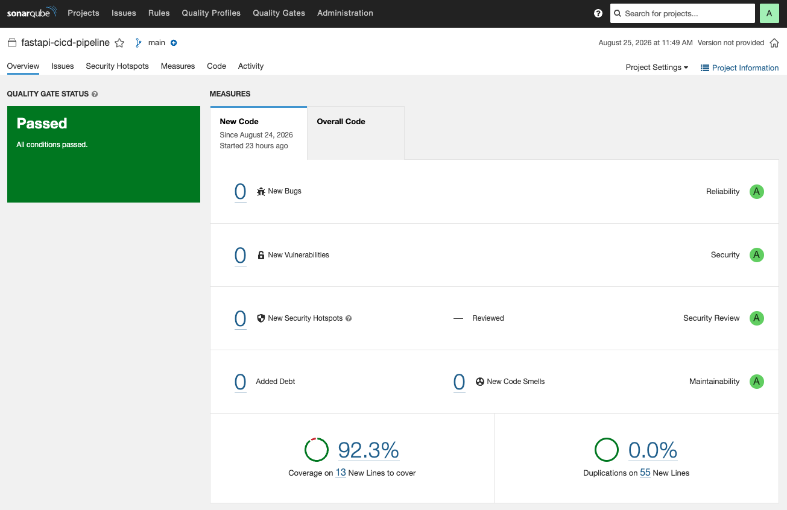
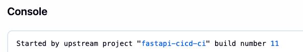
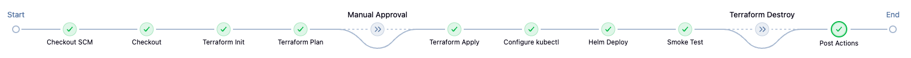
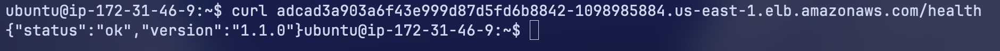

# FastAPI CI/CD Pipeline

A small FastAPI todo service wired into an end-to-end CI/CD pipeline on Jenkins.
Every push runs tests, static analysis and a security scan, builds a container
image and deploys it to a Kubernetes cluster on AWS.

The app itself is a simple CRUD todo API. The point of the project is the
pipeline and infrastructure around it, not the app.

## Architecture


## CI pipeline

Runs on every push (`Jenkinsfile`):

1. Install dependencies and lint with `black` and `flake8`.
2. Run tests with `pytest` and generate a coverage report.
3. Analyze the code with SonarQube and block on the quality gate.
4. Build the Docker image.
5. Scan the image with Trivy, failing on fixable HIGH/CRITICAL vulnerabilities.
6. Push the image to Amazon ECR, tagged with the commit SHA.

A successful run automatically triggers the CD pipeline.




## CD pipeline

Runs automatically after CI succeeds (`Jenkinsfile.infra`). It's parameterized
with an `apply`/`destroy` action:

1. `terraform apply` provisions or updates the VPC and EKS cluster.
2. Helm deploys the app with `--atomic`, so a bad deploy rolls back on its own.
3. A smoke test hits `/health` through the cluster.

Tearing the infrastructure down is the one step that stays manual, it asks
for confirmation before running.




ECR lives in its own Terraform state (`terraform/ecr`), separate from the
cluster (`terraform/infra`). Images survive even if the cluster is destroyed
and rebuilt. The VPC also uses public subnets with no NAT gateway, to avoid
the hourly NAT cost.

## Live access

The app is exposed through a Kubernetes `LoadBalancer` service, so it's
reachable at a public URL without port-forwarding.



## Running locally

```bash
python3 -m venv .venv
source .venv/bin/activate
pip install -r requirements-dev.txt

pytest -v
black --check app tests
flake8 app tests

uvicorn app.main:app --reload
```

## API

| Method | Endpoint      | Description                                        |
|--------|---------------|-----------------------------------------------------|
| GET    | `/`           | API info                                             |
| GET    | `/health`     | Health check                                         |
| POST   | `/tasks`      | Create a task                                        |
| GET    | `/tasks`      | List tasks (filter with `?is_done=true/false`)       |
| GET    | `/tasks/{id}` | Get a single task                                    |
| PUT    | `/tasks/{id}` | Update a task                                        |
| DELETE | `/tasks/{id}` | Delete a task                                        |

## Tech stack

- FastAPI and SQLAlchemy (SQLite)
- Docker
- Jenkins for CI/CD
- SonarQube for static analysis and coverage, Trivy for image scanning
- Terraform for AWS infrastructure (VPC, EKS, ECR)
- Helm for deploying to Kubernetes

## Reproducing the setup

**Server.** One Linux box works for both Jenkins and SonarQube. Install Docker,
AWS CLI, kubectl, Helm, Terraform and Trivy. Open ports 22 (SSH), 8080
(Jenkins) and 9000 (SonarQube) in the security group. Restrict Jenkins's
port to GitHub's published webhook IP ranges rather than the whole internet.
SonarQube runs easiest as a Docker container.

**AWS.** Create a separate IAM user for Jenkins with EC2, EKS, IAM, KMS and
CloudWatch Logs permissions. Run `terraform apply` once inside `terraform/ecr`
to create the image registry. Its state is kept separate from the cluster
(`terraform/infra`), so destroying the cluster doesn't affect it.

**Jenkins.** Install Jenkins. Install the Docker Pipeline, AWS Credentials and
SonarQube Scanner plugins. Add three credentials: `aws-account-id`,
`aws-creds`, `sonarqube-token`. The Jenkinsfiles reference these IDs
directly. Configure a SonarScanner tool named `sonar-scanner` and a SonarQube
server connection named `sonarqube-server`. Create two pipeline jobs: one
pointing at `Jenkinsfile`, one at `Jenkinsfile.infra`.

If the repo is private, generate an SSH key, add the public half as a GitHub
deploy key (read-only) and add the private half to Jenkins as an "SSH
Username with private key" credential with username `git`. Point each job's
repository URL at the SSH form (`git@github.com:...`) rather than HTTPS.

**Webhooks.** SonarQube → `<jenkins-url>/sonarqube-webhook/`, for quality gate
results. GitHub → `<jenkins-url>/github-webhook/`, for push-triggered builds.