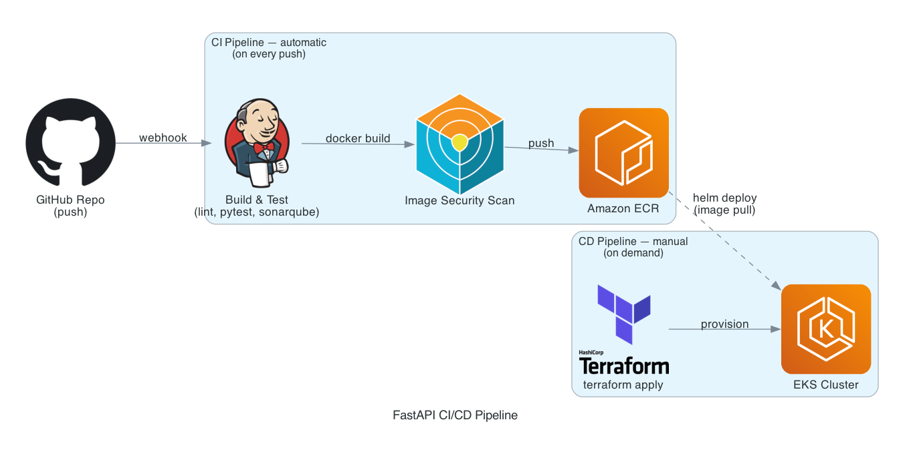

# FastAPI CI/CD Pipeline

A small FastAPI todo service wired into an end-to-end CI/CD pipeline on Jenkins.
Every push runs tests, static analysis and a security scan, then builds and
publishes a container image. Deployment to a Kubernetes cluster on AWS is a
separate, on-demand step.

The application itself is deliberately simple, a CRUD todo API. The point of the
project is the pipeline and infrastructure around it, not the app.

## Architecture



The diagram is generated from code in `architecture.py` (`python3 architecture.py`),
so it stays in sync with the design.

## CI pipeline

Runs automatically on every push (`Jenkinsfile`):

1. Install dependencies and lint with `black` and `flake8`.
2. Run the test suite with `pytest`.
3. Analyze the code with SonarQube and block on the quality gate.
4. Build the Docker image.
5. Scan the image with Trivy, failing on HIGH or CRITICAL findings.
6. Push the image to Amazon ECR, tagged with the short commit SHA.

## CD pipeline

Runs manually, on demand (`Jenkinsfile.infra`). It is parameterized with an
`apply`/`destroy` action and takes the image tag to deploy:

1. `terraform apply` provisions the VPC and EKS cluster.
2. A manual approval step gates anything that costs money.
3. Helm deploys the application to the cluster.
4. A smoke test hits `/health` through the service.
5. `terraform destroy` tears the cluster back down.

ECR lives in its own Terraform state (`terraform/ecr`), separate from the
cluster (`terraform/infra`). Images survive when the cluster is destroyed, so
each demo doesn't need a fresh build.

## Why the cluster isn't always on

Running EKS continuously costs money for a project that only needs to be live
during a demo. Instead the CD pipeline stands the cluster up with Terraform,
deploys and tears it down again afterwards. It keeps the bill near zero and
doubles as a demonstration of managing ephemeral infrastructure as code.

For the same reason the VPC uses public subnets with no NAT gateway. That avoids
the hourly NAT cost; a long-lived environment would put nodes in private subnets
behind one.

## Running locally

```bash
python3 -m venv .venv
source .venv/bin/activate
pip install -r requirements-dev.txt

pytest -v
black --check app tests
flake8 app tests

uvicorn app.main:app --reload
```

Interactive API docs are at `http://localhost:8000/docs`.

## API

| Method | Endpoint       | Description        |
|--------|----------------|--------------------|
| GET    | `/health`      | Health check       |
| POST   | `/tasks`       | Create a task      |
| GET    | `/tasks`       | List all tasks (filter with `?is_done=true/false`) |
| GET    | `/tasks/{id}`  | Get a single task  |
| PUT    | `/tasks/{id}`  | Update a task      |
| DELETE | `/tasks/{id}`  | Delete a task      |

## Tech stack

- FastAPI and SQLAlchemy (SQLite for local development)
- Docker
- Jenkins for CI/CD
- SonarQube for static analysis, Trivy for image scanning
- Terraform for AWS infrastructure (VPC, EKS, ECR)
- Helm for deploying to Kubernetes
